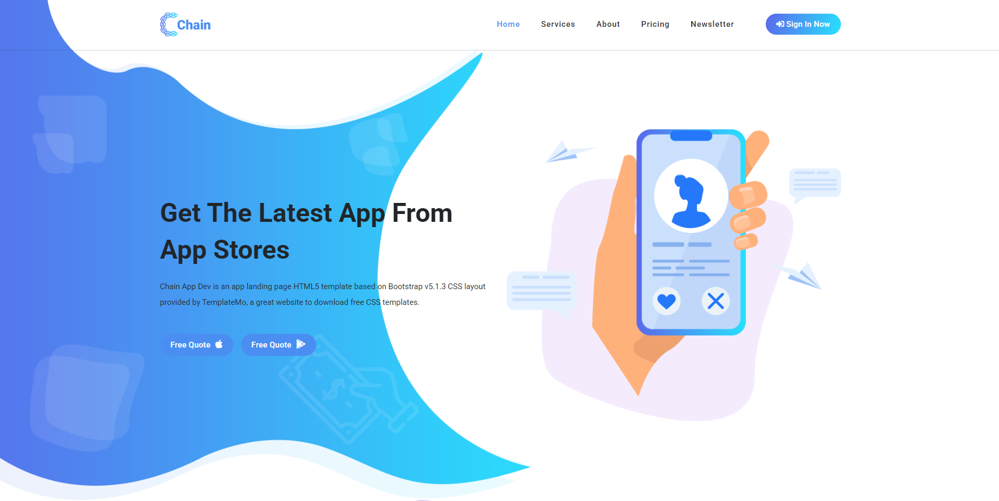

# AppDev1 Midterm Exam Project  

A simple web application built as part of the **Application Development 1 Midterm Exam**.  
This project showcases frontend development skills using **HTML, CSS, JavaScript, and vendor libraries**.  

---

## 🌐 Live Demo  
🔗 [View Deployed Project](https://Lvly-00.github.io/appdev1-midterm-exam/)  

---

## 📸 Screenshots  

### Homepage  
  


---

## ⚙️ Features  
- Responsive UI design  
- Bootstrap components for layout and styling  
- Owl Carousel for image sliders  
- jQuery animations and interactivity  
- Custom CSS enhancements  

---

## 📂 Project Structure  

```bash
appdev1-midterm-exam/
├── public/
│   ├── assets/
│   │   ├── css/
│   │   ├── js/
│   │   └── images/
│   └── vendor/
│       ├── bootstrap/
│       └── jquery/
├── index.html
├── README.md
